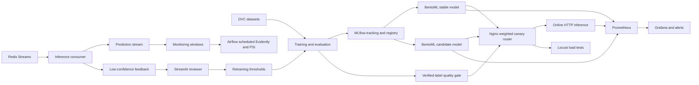

# Final architecture

The same model artifact supports online HTTP inference, batch inference, and
Redis Streams inference. Stable/candidate routing is operationally separate
from model training, which makes rollback a router change rather than a model
mutation.
